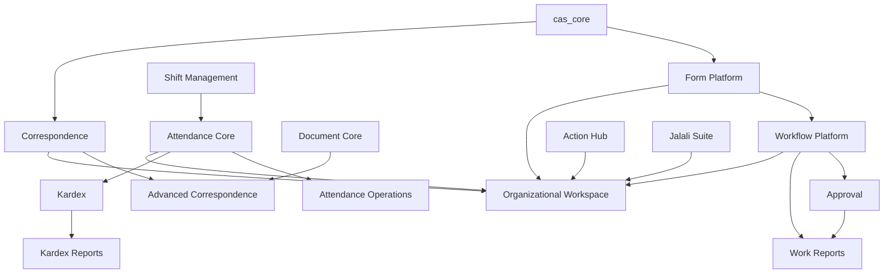

# راهنمای ماژول‌های CAS برای Odoo 19 Community

این مخزن شامل ۲۴ ماژول است. هر ماژول یک `README.md` برای معرفی و شروع سریع و یک فایل `docs/ARCHITECTURE_AND_USAGE.md` برای معماری، نقش‌ها، سناریوها، امنیت، آزمون و عیب‌یابی دارد.

## نقشه معماری

## فهرست ماژول‌ها

| حوزه | ماژول | کاربرد اصلی | نوع استفاده |
|---|---|---|---|
| پایه | [cas_core](cas_core/README.md) | مرز فنی مشترک | فنی |
| فرم | [cas_form_core](cas_form_core/README.md) | مدل نسخه‌دار فرم و پاسخ | طراح/کاربر |
| فرم | [cas_dynamic_form](cas_dynamic_form/README.md) | اجرای فرم منتشرشده | کاربر |
| فرم | [cas_form_builder](cas_form_builder/README.md) | طراح drag-and-drop | طراح |
| گردش کار | [cas_workflow_core](cas_workflow_core/README.md) | موتور حالت، گذار، اجرا و SLA | فرایندی |
| گردش کار | [cas_workflow_designer](cas_workflow_designer/README.md) | طراح node-based | طراح |
| عملیات | [cas_action_hub](cas_action_hub/README.md) | کارتابل یکپارچه اقدام‌ها | روزمره |
| تأیید | [cas_approval_core](cas_approval_core/README.md) | تأیید چندمرحله‌ای و نمایندگی | روزمره/مدیریتی |
| مکاتبات | [cas_correspondence](cas_correspondence/README.md) | نامه، گیرنده، ارجاع و ممیزی | روزمره |
| مکاتبات | [cas_correspondence_advanced](cas_correspondence_advanced/README.md) | دبیرخانه، ثبت، PDF و امضا | تخصصی |
| اسناد | [cas_document_core](cas_document_core/README.md) | سند نسخه‌دار، ذخیره و OCR | روزمره/تخصصی |
| منابع انسانی | [cas_shift_management](cas_shift_management/README.md) | سیاست، شیفت و برنامه روزانه | برنامه‌ریزی |
| منابع انسانی | [cas_attendance_core](cas_attendance_core/README.md) | رخداد و تطبیق حضور | عملیاتی |
| منابع انسانی | [cas_attendance_operations](cas_attendance_operations/README.md) | Excel آفلاین و ثبت نگهبانی | عملیاتی |
| منابع انسانی | [cas_kardex_management](cas_kardex_management/README.md) | کاردکس دقیقه‌ای و قفل دوره | عملیاتی/مدیریتی |
| گزارش | [cas_kardex_report](cas_kardex_report/README.md) | Excel جزئی و خلاصه کاردکس | گزارشی |
| گزارش کار | [cas_work_report](cas_work_report/README.md) | گزارش روزانه و تأیید | روزمره |
| تاریخ جلالی | [cas_jalali](cas_jalali/README.md) | هسته فیلد و picker | فنی |
| تاریخ جلالی | [cas_jalali_hr](cas_jalali_hr/README.md) | پل کارکنان | فنی |
| تاریخ جلالی | [cas_jalali_mail](cas_jalali_mail/README.md) | پل Chatter | فنی |
| تاریخ جلالی | [cas_jalali_qweb](cas_jalali_qweb/README.md) | پل QWeb/PDF | فنی |
| تاریخ جلالی | [cas_jalali_search](cas_jalali_search/README.md) | فیلتر شمسی | کاربر/فنی |
| تاریخ جلالی | [cas_jalali_suite](cas_jalali_suite/README.md) | نصب یکجای خانواده جلالی | فنی |
| تجربه کاربری | [cas_workspace](cas_workspace/README.md) | پوسته اختصاصی RTL | روزمره |

## ترتیب پیشنهادی مطالعه

1. برای شناخت معماری: Core ← Form ← Workflow ← Approval/Action Hub.
2. برای عملیات اداری: Correspondence ← Document ← Correspondence Advanced.
3. برای حضور و کارکرد: Shift ← Attendance Core ← Operations ← Kardex ← Reports.
4. برای تجربه کاربر: ابتدا ماژول دامنه‌ای و سپس Workspace را بخوانید.
5. برای تاریخ شمسی: Jalali Core و بعد bridge مرتبط را بررسی کنید.

## قاعده مالکیت

- Workspace مالک داده کسب‌وکاری نیست؛ فقط تجربه یکپارچه می‌سازد.
- Action Hub مالک کار نیست؛ اقدام قابل انجام را از منبع جمع می‌کند.
- Designerها مالک runtime نیستند؛ schema نسخه پیش‌نویس هسته را ویرایش می‌کنند.
- Jalali مالک تاریخ ذخیره‌شده نیست؛ ورودی و نمایش انسانی را تبدیل می‌کند.
- سوابق رسمی با نسخه، رخداد، ابطال یا بازگشایی ممیزی‌پذیر اصلاح می‌شوند، نه حذف تاریخچه.

## قرارداد مستندسازی

هر تغییر در مدل، نقش، منو، چرخه وضعیت، API، asset یا وابستگی باید در همان commit در README و راهنمای کامل ماژول منعکس شود. مستند ناسازگار با کد یک نقص انتشار محسوب می‌شود.
