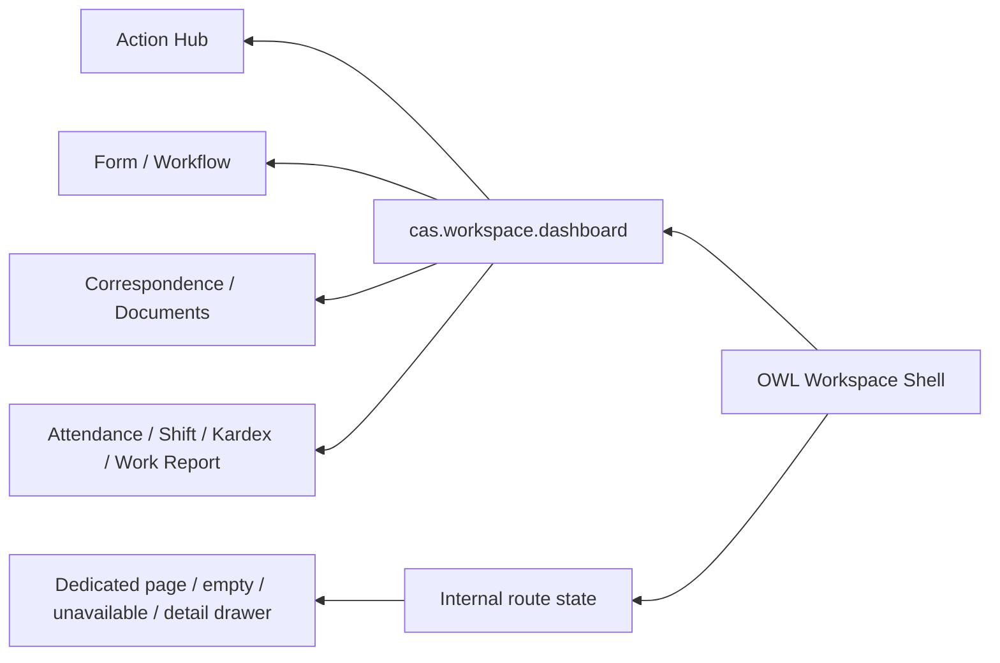

# معماری و راهنمای استفاده از CAS Organizational Workspace

## هدف محصول

Workspace باید تجربه‌ای یکپارچه و قابل تشخیص به‌عنوان محصول CAS بسازد؛ نه اینکه یک ستون سفارشی کنار صفحه پیش‌فرض Odoo بچسباند. پوسته، ناوبری، scroll، جهت RTL، حالت‌های responsive و صفحات داده باید یک مالک واحد داشته باشند.

## وابستگی‌ها

- `web`
- `cas_action_hub`
- `cas_correspondence`
- `cas_attendance_core`
- `cas_workflow_core`
- `cas_form_core`

بعضی routeها مدل ماژول‌های اختیاری مانند اسناد، تأییدها، کاردکس یا گزارش کار را مصرف می‌کنند. اگر مدل نصب نباشد، صفحه باید unavailable نمایش دهد و crash نکند.

## معماری



### سرویس backend

- `get_navigation()`: ناوبری و فهرست ماژول‌های CAS نصب‌شده
- `get_workspace_data()`: آمار و داده داشبورد
- `get_page_data(route, query, offset, limit)`: صفحه داده با جستجو و pagination
- `get_record_detail(route, record_id)`: جزئیات مجاز رکورد
- `PAGE_CONFIGS`: مدل، domain، ستون‌ها و ترتیب امن هر route

### client action

`workspace.js` وضعیت route، loading، جستجو، صفحه‌بندی، بازشدن جزئیات و sidebar را مدیریت می‌کند. `workspace.xml` تنها shell فعال است و `workspace.scss` باید overflow محتوای اصلی و sidebar را مستقل کنترل کند.

## منطق ناوبری

- مقصدهای روزمره مانند «کارتابل من» و «اقدام فوری» باید برای همه کاربران مجاز قابل دسترس باشند.
- مقصدهای طراحی مانند Form Builder و Workflow Designer فقط برای نقش طراح و از زمینه تعریف فرم/فرایند باز شوند.
- مقصدهای مدیریتی و تنظیمات باید بر اساس نقش ساخته شوند؛ یک لینک ثابت به کاربران Odoo «تنظیمات سامانه» محسوب نمی‌شود.
- route باید داخل همان shell عوض شود. اجرای raw action که صفحه استاندارد Odoo را زیر sidebar باز کند، نقض معماری است.

## امنیت

1. مدل‌ها بدون `sudo` جستجو می‌شوند تا record rule منبع اعمال شود.
2. جزئیات رکورد باید `check_access("read")` را پاس کند.
3. ستون‌های binary، HTML و رابطه‌های حجیم در صفحه عمومی serialize نمی‌شوند.
4. route ناشناخته یا مدل نصب‌نشده نتیجه کنترل‌شده برمی‌گرداند.
5. جستجو فقط روی فیلدهای متنی مجاز و order فقط روی فیلدهای موجود اعمال می‌شود.

## تجربه responsive و scroll

- در دسکتاپ sidebar به لبه راست pin می‌شود و collapse/expand پایدار دارد.
- در موبایل sidebar به‌صورت off-canvas باز و پس از انتخاب مقصد بسته می‌شود.
- محتوای اصلی و فهرست طولانی sidebar هرکدام scroll مستقل دارند.
- body نباید به‌دلیل `100vh` یا overflow اشتباه قفل شود.
- جدول عریض باید container افقی خودش را داشته باشد و عرض viewport را نشکند.
- جهت متن فارسی در کل shell RTL است؛ شناسه، ایمیل، عدد فنی و کد می‌توانند با کلاس مشخص LTR باشند.

## سناریوی استفاده

1. کاربر وارد Workspace می‌شود و داشبورد شخصی را می‌بیند.
2. «اقدام فوری» route جداگانه را باز می‌کند؛ فقط scroll یا فیلتر داشبورد تغییر نمی‌کند.
3. انتخاب یک حوزه، صفحه اختصاصی با عنوان، جستجو، وضعیت خالی و pagination می‌سازد.
4. کلیک ردیف drawer جزئیات را باز می‌کند؛ عملیات تخصصی باید به flow همان دامنه هدایت شود.
5. بازگشت و تغییر route shell و وضعیت sidebar را حفظ می‌کند.

## تنظیمات

نسخه فعلی فقط inventory کاربران داخلی و ماژول‌های CAS نصب‌شده را نشان می‌دهد. طراحی صحیح تنظیمات باید بعداً به دسته‌های واقعی مانند شرکت، دسترسی، SLA، دبیرخانه، حضور، ذخیره‌سازی و یکپارچه‌سازی تقسیم شود و هر دسته مدل تنظیمات معتبر خودش را ویرایش کند.

## آزمون و QA

```bash
./odoo-bin -d <database> -u cas_workspace --stop-after-init
./odoo-bin -d <database> --test-enable --test-tags /cas_workspace -u cas_workspace --stop-after-init
```

چک‌لیست انتشار:

1. parse شدن XML و syntax فایل JavaScript
2. compile شدن SCSS واقعی Odoo
3. در دسترس بودن همه routeها با مدل‌های نصب‌شده/نشده
4. آزمون کاربر عادی، طراح، مدیر و چندشرکتی
5. screenshot در عرض موبایل، تبلت، لپ‌تاپ و دسکتاپ
6. scroll صفحه بلند، جدول عریض و sidebar بلند
7. keyboard و focus، به‌ویژه Escape و Enter با handler استاندارد OWL
8. عدم وجود shell قدیمی یا sidebar تزریقی در asset نهایی

## راهنمای توسعه

- route جدید را با مدل، ستون‌های حداقلی، domain و نقش روشن اضافه کنید.
- برای عملیات دامنه‌ای پیچیده صفحه اختصاصی بسازید؛ table عمومی جای UX واقعی ماژول نیست.
- modifierهای Vue مانند `.enter` در OWL معتبر نیستند؛ رویداد keyboard را در handler بررسی کنید.
- loading، empty، unavailable، forbidden و error را یک وضعیت واحد فرض نکنید.
- هر تغییر بصری باید با screenshot پس از deploy سنجیده شود، نه فقط compile شدن کد.

## عیب‌یابی

- **صفحه استاندارد Odoo زیر sidebar دیده می‌شود:** مسیر هنوز raw action اجرا می‌کند یا asset shell قدیمی بارگذاری شده است.
- **route عوض نمی‌شود:** state router و handler کلیک را بررسی کنید.
- **صفحه سفید است:** اولین OwlError مربوط به template/event را از asset غیر minified پیدا کنید.
- **scroll قفل است:** زنجیره ارتفاع و overflow از body تا content را کنترل کنید.
- **ستون سمت چپ می‌رود:** جهت flex، position و breakpoint مالک sidebar را بررسی کنید.
- **Settings فقط کاربران را نشان می‌دهد:** این محدودیت نسخه فعلی است و باید با settings hub دامنه‌ای جایگزین شود.

## مرجع فنی

فهرست دقیق مدل‌ها، فیلدها، متدها، ACL، record rule، منوها، actionها، cronها، assetها و آزمون‌ها در [مرجع فنی استخراج‌شده از کد](TECHNICAL_REFERENCE.md) نگهداری می‌شود.
